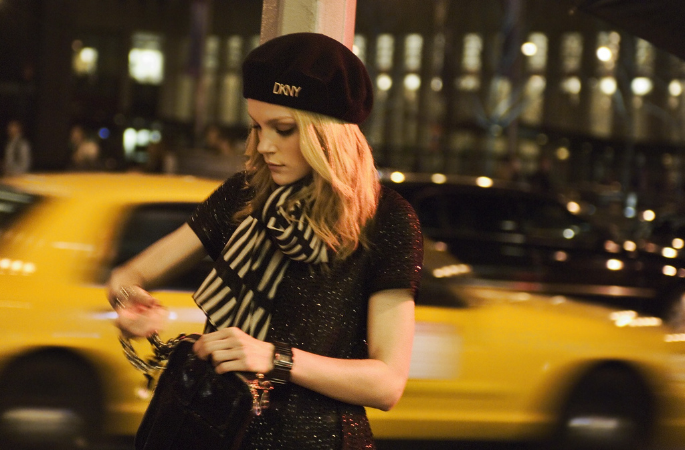
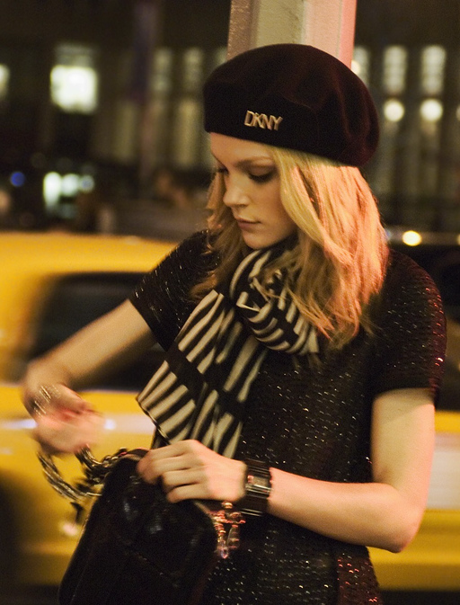
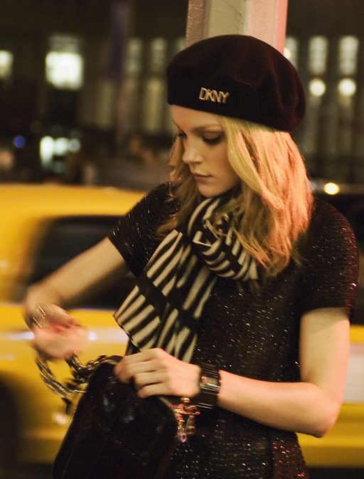
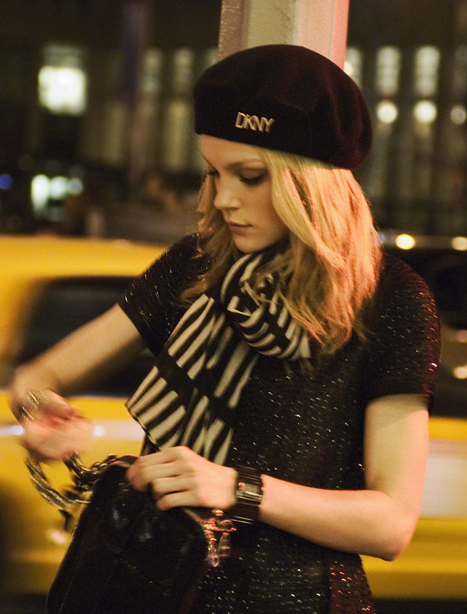
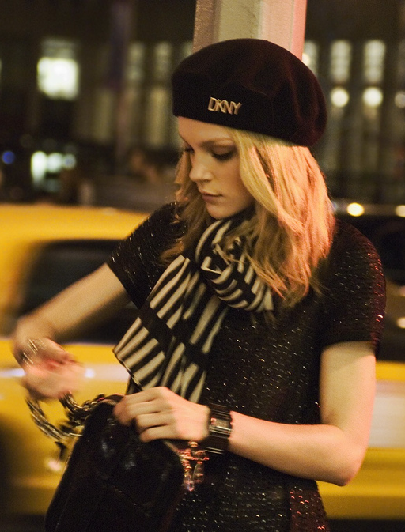
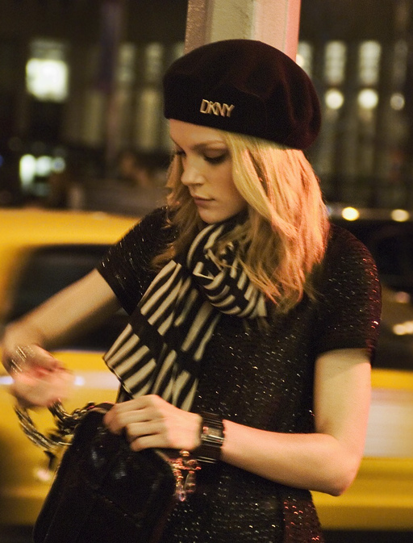
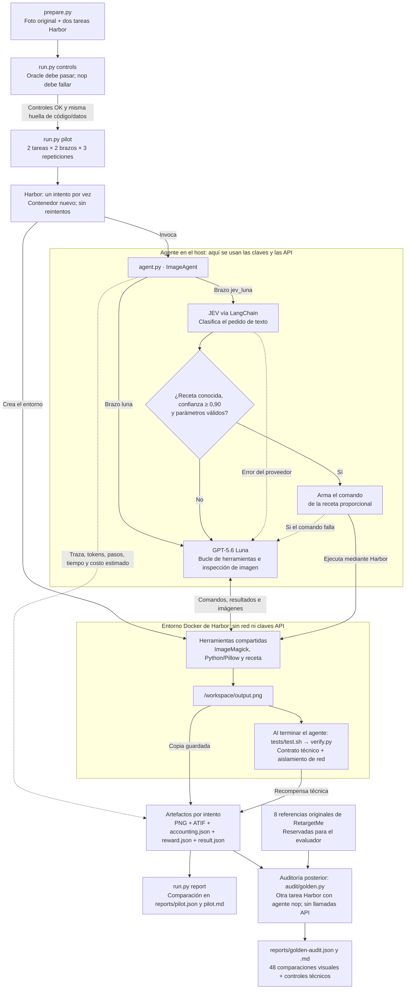

# Image Agent Bench

¿Puede un clasificador pequeño reconocer un procedimiento conocido y ahorrar
llamadas a un agente generalista, conservando el resultado?

Piloto con **Harbor 0.20.0**, **GPT-5.6 Luna** y **JEV vía LangChain**.
Luna dispone de las mismas herramientas y procedimientos en ambos brazos.
JEV clasifica texto; no observa imágenes ni genera comandos arbitrarios.

**Estado: piloto ejecutado y auditado; el pedido publicitario completo sigue
pendiente.** La comparación contra golden está corrida; la aprobación visual
y los ocho tamaños publicitarios con límite de 150 kB aún no están completados.

## Imagen y referencias

Elegimos **DKNYgirl** de [RetargetMe](https://people.csail.mit.edu/mrub/retargetme/):
una persona delante de taxis. El objetivo visual es pasar de 1024×673 a
512×673 conservando a la persona sin deformarla. RetargetMe incluye resultados
de ocho métodos y preferencias humanas; no existe una única respuesta perfecta.
Los votos originales no califican automáticamente una nueva salida.

Los archivos originales y referencias se obtienen del archivo oficial de 2011,
sin alterar sus dimensiones ni incluir referencias dentro del entorno del agente.
El código es abierto; las imágenes conservan sus créditos y condiciones originales.

## Antes y después — archivos reales

Imágenes copiadas de las ejecuciones registradas, sin retoques. Se muestran todas
las repeticiones visuales, incluidas las salidas idénticas. Los PNG conservan su
resolución original; el ancho de visualización en esta página es solo para lectura.

| Original: 1024×673 | Referencia humana CR: 512×673 |
|---|---|
|  |  |

La referencia CR es el resultado más preferido para esta foto con original visible
(57 de 63 comparaciones). Es un recorte del original desde x=136 hasta x=648.

| Repetición | Luna | JEV → Luna |
|---|---|---|
| 1 | <br>512×673 · 550,288 bytes<br>Recorte x=128 · diferencia respecto de CR: -8 px | <br>512×673 · 550,288 bytes<br>Recorte x=128 · diferencia respecto de CR: -8 px |
| 2 | <br>512×673 · 551,015 bytes<br>Recorte x=150 · diferencia respecto de CR: +14 px | <br>512×673 · 550,888 bytes<br>Recorte x=145 · diferencia respecto de CR: +9 px |
| 3 | <br>512×673 · 544,359 bytes<br>Recorte x=160 · diferencia respecto de CR: +24 px | <br>512×673 · 551,015 bytes<br>Recorte x=150 · diferencia respecto de CR: +14 px |

**Resize proporcional, repetición 1.** Las seis ejecuciones técnicas produjeron
el mismo PNG 512×337, de 268.121 bytes. Se muestran ambos brazos:

| Luna | JEV → receta |
|---|---|
|  |  |

Fuente y créditos: Rubinstein, Gutierrez, Sorkine y Shamir,
[*A Comparative Study of Image Retargeting*](https://people.csail.mit.edu/mrub/retargetme/),
2010; archivos de RetargetMe del 12/05/2011. Las fotografías y recortes no están
cubiertos por la licencia MIT del código. [Origen y SHA-256 de cada imagen](reports/image-manifest.json).

## Alcance del piloto

1. **Procedimiento conocido:** reducir el ancho a 512 manteniendo la proporción
   y exportar un PNG. Es un control técnico, no una tarea oficial de RetargetMe.
2. **Decisión visual:** reducir solamente el ancho a 512, mantener alto 673 y
   preservar a la persona. Sin márgenes ni imágenes generadas. Se compara contra
   las referencias originales de RetargetMe.

Dos sistemas × dos tareas × tres repeticiones, secuenciales y en orden alternado.
Tope de API: USD 5 incluyendo preparación; 10 minutos y 40 llamadas por tarea.
Las referencias y los votos permanecen exclusivamente en el evaluador.
La calidad visual exige revisión humana ciega; éxito técnico no significa calidad.

## Cómo usamos Harbor

Harbor **ejecuta y evalúa cada intento**: crea el contenedor, invoca nuestro
agente y corre el verificador al terminar. El controlador del repo organiza la
comparación; `ImageAgent` decide las llamadas y registra su consumo.



Cada tarea creada por [prepare.py](prepare.py) tiene `instruction.md`, `task.toml`,
`environment/`, `solution/solve.sh` para el oracle y `tests/test.sh` para el
verificador. [run.py](run.py) llama a `harbor run --agent agent:ImageAgent`;
[agent.py](agent.py) implementa la interfaz `BaseAgent` de Harbor. Ambos brazos
tienen las mismas herramientas y acceso a la receta; JEV puede evitar el bucle
de Luna cuando reconoce el procedimiento.

Las API se llaman desde el host; los comandos se ejecutan en Docker como usuario
sin privilegios. El verificador se incorpora después del agente. Las referencias
golden no se entregan a los agentes del piloto: [audit/golden.py](audit/golden.py)
las compara después contra los archivos guardados, en una ejecución separada.

Harbor conserva los resultados de cada intento; nuestra instrumentación calcula
los costos a partir de tokens y tarifas. **No son importes facturados.** El tiempo
del agente incluye JEV, Luna y herramientas; el tiempo total también incluye el
contenedor y la evaluación. La recompensa del piloto mide cumplimiento técnico;
la aceptación visual humana sigue pendiente.

## Primer resultado medido

12/12 salidas pasaron la verificación técnica. Una foto y tres repeticiones por
combinación; la revisión humana de calidad visual sigue pendiente.

Promedios por ejecución. Tiempo = agente completo; llamadas y herramientas se cuentan por separado.

| Tarea | Sistema | Tokens entrada / salida | Llamadas modelo | Herramientas | Tiempo (s) | USD estimados |
|---|---|---:|---:|---:|---:|---:|
| technical | luna | 1358.3 / 116.3 | 2.67 | 1.67 | 5.65 | 0.0004113 |
| technical | jev_luna | 436.0 / 38.0 | 1.00 | 1.00 | 1.74 | 0.0000183 |
| visual | luna | 5475.3 / 396.3 | 4.00 | 3.00 | 12.21 | 0.0008851–0.0009484 |
| visual | jev_luna | 5990.0 / 436.0 | 5.00 | 3.00 | 13.71 | 0.0009918–0.0010778 |

En el resize conocido, JEV + receta usó **95,5% menos costo estimado** y **69,3% menos
tiempo de agente**. En el caso visual, JEV derivó a Luna las tres veces: añadió una
llamada y el conjunto fue algo más lento y caro. Esto apoya reconocer procedimientos
conocidos; no prueba que encadenar modelos siempre sea mejor.

Con arranque del contenedor y evaluación, los tiempos medios de Harbor fueron:
technical / luna: 22.06 s; technical / jev_luna: 18.22 s; visual / luna: 29.07 s; visual / jev_luna: 30.67 s.

Costo de API del trabajo experimental completo: **USD 0,00742694–0,00787494**,
incluyendo un intento previo fallido al guardar la traza. Son estimaciones por
tokens, no facturas; no incluyen desarrollo, infraestructura ni esta conversación.

[Resultados por intento](reports/pilot.json) · [Protocolo](reports/protocol.md) ·
[Trazas ATIF y llamadas](reports/traces.jsonl) · [Controles](reports/controls.json) ·
[Conciliación de consumo](reports/accounting-audit.json)

## ¿Se logró todo? Evidencia y comparación con golden

**El piloto funcionó; el pedido publicitario completo todavía no está logrado.**
El 12/12 anterior corresponde al contrato técnico reducido de dos tareas PNG.

| Comprobación | Resultado |
|---|---|
| Ejecuciones originales en Harbor, con trazas y consumo | 12/12 verificadas |
| Resize proporcional contra cálculo independiente | 6/6 pasan |
| Salidas visuales × referencias originales | 6×8 = 48 comparaciones ejecutadas en Harbor |
| Coincidencia exacta con cualquiera de las ocho referencias | 0/6 |
| Recorte exacto del original, sin reescalar ni inventar píxeles | 6/6 |
| Desplazamiento horizontal respecto del recorte CR | 8–24 píxeles |
| Archivos actuales de hasta 150.000 bytes | 0/12; pesan 268.121–551.015 bytes |
| Ocho tamaños publicitarios × cuatro extensiones | No ejecutado |
| Aceptación humana de calidad visual | Pendiente |

La nueva verificación es un **replay de los archivos guardados**, ejecutado en
Harbor con agente `nop`, con controles de identidad, referencias diferentes y
dimensiones incorrectas. No son 12 ejecuciones nuevas de los modelos. Los SHA-256
vinculan cada imagen con la traza publicada y las referencias originales.
La versión instalada de Harbor 0.20.0 no expone `job regrade`; se usa una tarea
adicional que evalúa los artefactos guardados y conserva intactos los resultados
del piloto. Costo de API de esta reevaluación: USD 0.

Comparamos igualdad de píxeles, MAE, RMSE, PSNR y geometría del recorte. Son
distancias descriptivas; **no tienen un umbral inventado de calidad aprobada**.
Un encuadre distinto puede ser válido. Los votos del estudio califican sus
resultados históricos, y no pueden transferirse automáticamente a nuevas salidas.
El [estudio original](https://people.csail.mit.edu/mrub/retargetme/) advierte que
las distancias computacionales no siempre coinciden con la preferencia humana.

[Informe y evidencias](reports/golden-audit.md) ·
[48 comparaciones, hashes y recibos de Harbor](reports/golden-audit.json).

El CSV de consumo aportado coincide a nivel agregado con JEV: **6 solicitudes,
2.730 tokens de entrada y 222 de salida**. No incluye importes ni permite
conciliar solicitudes individuales o facturación de OpenAI. Se publica solamente
el [resumen sin identificadores privados](reports/provider-usage-check.json).

## Ejecutar

Requiere Docker funcionando y [uv](https://docs.astral.sh/uv/). El primer paso
descarga el archivo oficial (~595 MB); selecciona una foto y ocho referencias.

```sh
uv sync --locked
uv run python prepare.py
uv run python -m unittest -v test_bench
uv run python run.py controls
uv run python run.py pilot --env-file /ruta/privada/.env
uv run python run.py report
```

Para repetir la auditoría contra golden sobre los mismos archivos locales,
sin llamar a los modelos:

```sh
uv run python -m unittest -v test_bench audit.test_golden
uv run python audit/golden.py run
```

Esta auditoría requiere los artefactos originales en `local-results/jobs/`.
El informe publicado conserva sus identificadores y hashes; `assets/` contiene
copias verificadas para visualizar los resultados en GitHub.

El archivo privado debe definir `OPENAI_API_KEY` y `TYPESAFE_API_KEY`; también
se aceptan `open_ai_api_key` y `jev_api_key`. Las claves se cargan en memoria
del controlador y no se copian al contenedor ni a las trazas. No publicar `.env`.

Los controles exigen que la solución conocida pase y que no hacer nada falle,
para ambas tareas. Un cambio de código o datos invalida ese control.
Docker ejecuta las herramientas sin red y con usuario sin privilegios;
el evaluador comprueba que no haya rutas IPv4 y que una conexión externa devuelva
«red inalcanzable» (el kernel puede mostrar interfaces de túnel inactivas).
La instalación de herramientas ocurre al construir la imagen, antes del agente.

`reports/pilot.md` resume resultados; `reports/pilot.json` conserva cada medición.
`local-results/comparison.html` permite revisar salidas con los brazos ocultos.
Las trazas ATIF, llamadas y archivos completos quedan en `local-results/jobs/`.
`budget.json` conserva gasto estimado y reservas de solicitudes inciertas entre
ejecuciones; no borrarlo para repetir pruebas bajo el mismo presupuesto.

## Qué prueba y qué queda pendiente

JEV selecciona una receta conocida y valida sus parámetros; ante una petición
visual o desconocida usa exactamente el mismo Luna del otro brazo. La función
`select_route` concentra la integración JEV: otro clasificador puede reemplazarla
manteniendo su contrato, pero habría que volver a medir precisión y latencia.
No hay un modelo entrenado para ImageMagick ni una colección de especialistas.

Es un piloto de una foto, dos instrucciones y tres repeticiones por combinación;
no prueba generalización. Usa terminal e inspección de imágenes, no una GUI.
Los formatos publicitarios originales (8 dimensiones únicas × JPG/JPEG/GIF/PNG,
incluidos 300×600, 320×50 y 320×250, hasta 150 kB) son una siguiente evaluación;
este piloto conserva las dimensiones del estudio y admite PNG hasta 10 MB.

Tarifas verificadas el 23/09/2026: [Luna](https://developers.openai.com/api/docs/models/gpt-5.6-luna)
y [JEV](https://docs.typesafe.ai/models). Se informan estimaciones por tokens,
con intervalo si el proveedor no distingue escrituras de caché; no facturas.
Un consumo ausente queda desconocido y conserva su reserva presupuestaria.

## Referencia

Michael Rubinstein, Diego Gutierrez, Olga Sorkine y Ariel Shamir.
*A Comparative Study of Image Retargeting*. ACM Transactions on Graphics 29(6),
SIGGRAPH Asia 2010. [Datos, resultados y votos](https://people.csail.mit.edu/mrub/retargetme/download.html).
